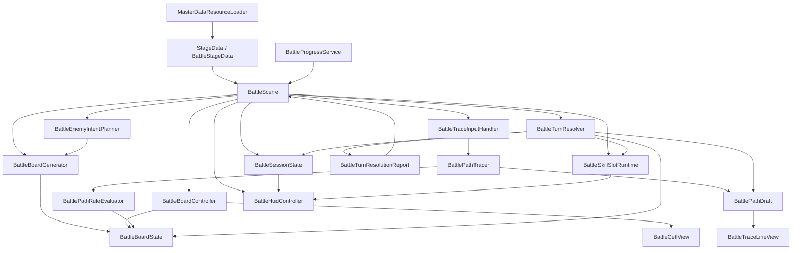

# Path-Activation System v2 仕様書

- 最終更新: 2026-04-30
- 文書状態: 現行の正本
- 位置づけ: 本書は v1 を前提にしない。今後仕様が衝突した場合は、原則として本書を優先する。

## 1. 企画の中核コンセプト

Path-Activation System v2 は、敵の攻撃を見ながら 1 ターンに 1 本の行動パスを組み立て、通過順に行動を解決する思考型ターン制バトルである。

面白さの中心は次の 3 点にある。

- そのターンでどのルートを取るかという攻め方の選択
- Jump / Roll をどこで使い、何を避けて何を受けるかという危険処理の選択
- 無傷では届かない局面で、被弾込みでも Goal に到達するかを決める不利受容の選択

v2 では Skill を盤面ノードではなく盤外 UI の Skill パレットから事前選択する方式に改める。Skill は主役の入力ではなく、そのターンの Attack ノードの価値を変える準備要素として扱う。

## 2. スコープと前提条件

### 2.1 戦闘人数

- 戦闘は 1 対 1
- 初期実装では敵は 1 体のみ

### 2.2 進行形式

- ターン制
- プレイヤーは 1 ターンに 1 本だけパスを引く
- 敵は 1 ターンに基本 1 アクションのみ行う

### 2.3 盤面サイズ

- 設計上の前提は 5x5 グリッド

### 2.4 レイヤー構成

- 上部レイヤー: プレイヤー、敵、ダメージ演出、勝敗演出
- 下部レイヤー: グリッド、ノード、危険、Start、Goal

## 3. 盤面要素

### 3.1 標準ノード種別

v2 標準盤面では次を扱う。

- Start
- Goal
- Attack
- Jump
- Roll
- Dance
- 危険
- 空白マス

### 3.2 Skill の扱い

- v2 では Skill は標準盤面ノードとして配置しない
- Skill は盤外 UI の Skill パレットから事前選択する
- 選択中 Skill は、そのターン中に通過した Attack ノードすべてを Skill 行動に変換する
- 特殊盤面として Skill ノードを持つ拡張は将来候補に残すが、標準仕様には含めない

### 3.3 マスの重なり

- 1 マスには 1 要素のみ配置可能
- ノードと危険は重複しない
- Goal の上に危険は置かない

### 3.4 空白マス

- 単なる通路として通過可能
- 固有効果は持たない
- Jump / Roll の保持中でも通過可能

## 4. 盤面配置方針

### 4.1 基本方針

- 当面は固定配置
- ランダム生成は将来拡張

### 4.2 Start / Goal

- Start は毎ターン固定位置
- Goal は敵やステージに応じて位置が変わる
- Goal は複数存在可能
- 初期実装では 1 個から 2 個程度を基準とする

### 4.3 Goal 配置思想

- Goal は危険の先に置かれることが多い
- ただし毎回回避前提にはしない
- 安全寄り Goal と危険越え前提の高価値 Goal の両方を許容する

### 4.4 5x5 盤面の目安

- Attack: 3 から 5
- Jump: 1 から 2
- Roll: 1 から 2
- Dance: 0 から 1
- Skill ノード: 0
- Goal: 1 から 2
- 危険: 5 から 9
- 空白は一定数残し、常に最大密度にはしない

### 4.5 回避ノード最低保証

- 回避なしでは Goal 到達不可の盤面では Jump または Roll を最低 1 つ配置する
- 回避なしでも Goal に届く盤面では、回避ノードなしを許容する

## 5. パス入力ルール

### 5.1 接続方向

- 8 方向隣接で接続可能

### 5.2 不正パス

以下は不正パスとする。

- 既に引いた線との交差
- 同じマスへの再訪
- Goal 到達後にさらに線を伸ばす行為

### 5.3 Goal の扱い

- Goal は終点専用マス
- パス途中の通過は不可
- Goal に触れた時点で確定可能状態に入る
- Goal 到達後に指が Goal から外れても確定可能状態は維持する
- 指を離した時点で確定する

### 5.4 Goal 未到達で指を離した場合

- 入力失敗
- パスは確定しない
- Start から引き直し可能
- 盤面は同ターン中変化しない
- 内部的には特殊敗北用の失敗累積対象になる

### 5.5 Skill 選択のタイミング

- Skill はパス開始前にのみ選択可能
- パス入力中は Skill を切り替えられない
- 同ターン中の引き直しでは選択済み Skill 状態を維持する

## 6. スタックと解決ルール

### 6.1 仮スタック

- パス入力中、通過したノードや危険は仮スタックとして扱う
- Goal 確定前は未確定

### 6.2 確定条件

- Goal に到達し、指を離した時点で仮スタックが確定する
- Goal に到達できなかった場合は不発

### 6.3 解決順

- 通過順にそのまま順次解決する
- ダメージ、回避、被弾、補助効果は都度即時反映する

### 6.4 HP0 時の処理

- スタック解決中でもどちらかの HP が 0 になった時点で戦闘終了
- 後続スタックは解決しない

### 6.5 Skill 変換の反映タイミング

- そのターンに Skill を選択している場合、Attack ノード解決時に選択中 Skill へ変換する
- そのターン中に通過した Attack はすべて同じ Skill に変化する
- Attack を複数回通過した場合は同一 Skill が複数回解決される

## 7. 各要素の仕様

### 7.1 Attack

- 基本攻撃ノード
- Skill 未選択時は通常攻撃として解決する
- Attack を 2 回通過するとダブルアタック化する
- Jump 後の Attack はジャンプアタック化する
- Jump による通常危険回避を挟んでもジャンプアタックは成立する

設計上の基準値:

- 通常 Attack: 100
- ダブル Attack 追撃: 125
- Jump Attack: 150

Skill 選択中の扱い:

- Attack ノードは通常 Attack として解決しない
- 選択中 Skill の行動として解決する
- ダブルアタック化やジャンプアタック化より Skill 変換を優先する

### 7.2 Jump

- 通常危険を回避できる
- Attack をジャンプアタック化できる
- 攻め寄りの回避ノード

保持ルール:

- 空白マスのみを何マス挟んでも保持する
- 最初に接触した通常危険グループに対して回避成立
- 危険回避後でも Attack につながればジャンプアタック成立
- Attack、Dance、Roll、その他ノードを挟むと消失する
- Skill 選択中は Attack が Skill 化されるため、Jump の攻撃強化は発生しない

### 7.3 Roll

- 純粋な回避専用ノード
- 通常危険とスキル危険の両方に対応する
- 攻撃派生は持たない

保持ルール:

- 空白マスのみを何マス挟んでも保持する
- 最初に接触した対応危険グループに対して回避成立
- 別ノードを 1 つでも挟むと消失する

### 7.4 Dance

- 支援ノード
- 効果内容はアイテム装備に依存する

想定役割:

- 自己強化
- 回復
- 敵弱体
- その他支援効果

初期実装では盤面上の存在と将来拡張の窓口を先に定義し、詳細効果は後追いでもよい。

### 7.5 Skill

- Attack の上位互換ではなく別カテゴリの個別行動
- 内容や見た目は武器装備に依存する
- 初期は広範囲の危険を置く純粋攻撃寄りを想定する

### 7.6 Skill パレット

- 各武器は最大 4 スロットの Skill パレットを持つ
- スロット状態は Ready、Charging、Locked、Empty を持つ
- 1 ターンに選択できる Skill は 1 種類のみ
- Skill はパス開始前に選択する
- Goal 未到達や不正パスで引き直す場合は選択済み状態を維持する
- Skill 選択状態でパスが確定した時点でその Skill は使用扱いになる
- Attack を 1 回も通らず不発でも、そのターンの選択は消費する

### 7.7 Goal

- パスの終点
- 仮スタック確定トリガー
- 被弾せず最後まで解決が到達した場合のみ Goal 効果が有効

設計方針:

- 初期実装では単一 Goal 効果でよい
- Goal 固有補正より、到達難度と到達直前の状態差で価値差を作る
- 将来は Jump Goal、Dance Goal などの拡張を許容する

### 7.8 危険

- 危険は盤面上の特殊マス
- パス上を通行可能
- 通過時に被弾または回避判定が発生する

危険種別:

- 通常危険
- スキル危険

攻撃グループ:

- 危険は内部的に攻撃グループ識別子を持つ
- 同一グループの危険を複数マス踏んでも被弾判定は 1 回だけ
- Jump / Roll が成立した場合はそのグループ全体を回避扱いにする

被弾時:

- 被弾した危険の解決までは成立
- その後の未解決スタックは破棄
- Goal 効果も不発
- 被弾前に成立済みの効果は残る

## 8. 回避と被弾の詳細

### 8.1 回避成立条件

- Jump は通常危険のみ対応
- Roll は通常危険とスキル危険に対応
- どちらも空白マスは保持可能
- 別ノードを挟むと消失

### 8.2 被弾前提盤面

- 通常戦でも被弾前提でしか Goal に届かない盤面を許容する
- 回避を使えば被害を軽減できる盤面はある程度の頻度で出る前提とする
- 回避ノードを使っても被弾回避不可の盤面は、主に強敵、ボス、大技ターンの例外局面で許容する

## 9. 敵仕様

### 9.1 基本方針

- 敵の行動カテゴリはプレイヤーと同系統の概念を使う
- ただし内部処理は敵専用の簡略ルールでよい
- 敵は 1 ターンに基本 1 アクション
- 敵はプレイヤーの Skill パレット UI を使わない

### 9.2 行動差別化

- 装備
- 行動傾向
- Skill 使用率
- Dance 使用率
- 危険配置パターン

### 9.3 敵タイプ

- ボス: 手作業設計
- 通常敵: タイプ分けで管理

### 9.4 初期実装で最初に作る通常敵

- バランス型
- 重みの目安
- 通常アタック系: 6
- Skill: 3
- Dance: 1

通常アタック系内訳:

- 通常アタック: 3
- ダブルアタック: 2
- ジャンプアタック: 1

### 9.5 敵 Dance

- 主目的は次ターン危険強化
- 初期実装では危険強化 1 パターンのみでよい

### 9.6 敵 Skill

- 初期は広範囲攻撃系
- 広い範囲に危険を置く純粋攻撃

## 10. 属性と装備

### 10.1 初期装備枠

- 武器 1 枠
- アイテム 1 枠
- 胴装備 1 枠
- 頭装備と左手装備は将来拡張

### 10.2 装備ごとの役割

- 武器: Attack、Skill、属性、見た目、Skill パレット
- アイテム: Dance
- 胴装備: 弱点と耐性

### 10.3 Skill スロット解放

- 4 スロットは武器ごとに設定する
- すべてが初期解放とは限らない
- 解放状態は武器ごとに管理できる設計にする

### 10.4 属性

- 初期は 4 属性想定
- 主用途は弱点、耐性によるダメージ補正
- 状態異常は属性ではなく将来的に Skill 由来で扱う

### 10.5 属性相性

- プレイヤー武器と敵胴装備
- 敵武器とプレイヤー胴装備

### 10.6 表示方針

- 弱点、耐性は常時 UI 表示しない
- ダメージ表示の装飾差で相性を示す

## 11. 持続効果

- 一時効果: そのターンのパス解決中だけ有効
- 持続効果: ターンをまたいで残る

初期実装では主にターン開始時とターン終了時だけ処理する。スタック途中で発動する持続効果は将来拡張とする。

## 12. 勝敗条件

### 12.1 基本勝敗

- 基本は HP0 による勝敗

### 12.2 特殊敗北

- Goal 到達失敗の累積による特殊敗北を持つ
- 意味づけはプレイヤーが隙を見せた状態

### 12.3 累積対象

- Goal まで届かず指を離した
- 不正パスで入力失敗した

以下は累積対象にしない。

- 被弾による Goal 効果不発
- HP ダメージによる通常敗北

### 12.4 表示方針

- 特殊敗北カウントは UI に出さない
- セリフや演出、説明文で匂わせる

## 13. UI 要件

### 13.1 必須表示情報

- 自分 HP
- 敵 HP
- 敵名
- ターン数
- 盤面要素一式
- Skill パレット
- ダメージ量
- 属性相性表現
- 敵 Dance 後の次ターン危険強化表示
- 特殊敗北演出用の敵短文
- 行動ログ

### 13.2 Skill パレット表示

- 武器に紐づく 4 スロット
- 準備ゲージ表示
- Ready が一目で分かる
- 未取得と未設定が見分けやすい

### 13.3 入力中可視化

- 仮スタック一覧は出さない
- 短い確定情報テキストで示す
- おすすめルートや推測は言わない

例:

- いける
- 危ない
- 跳ぶ!
- 続ける!
- 決める

## 14. 1 ターンの基本フロー

1. ターン開始時効果を処理
2. 敵行動に応じた盤面、危険、Goal を表示
3. 必要に応じて Skill を事前選択
4. プレイヤーがパス入力
5. Goal 到達後、指を離して確定
6. スタックを通過順に解決
7. ターン終了時効果を処理
8. 次ターンへ移行

## 15. データとシーン遷移

### 15.1 戦闘用ステージデータ

戦闘開始時に最低限必要なデータ:

- ステージ ID
- ステージ名
- 説明文
- 背景画像
- プレビュー画像
- 敵一覧

### 15.2 ステージ進捗データ

進捗側は以下を保持できる設計とする。

- StageId
- IsUnlocked
- IsCleared
- ClearCount
- BestScore
- BestRank
- BestClearTimeSeconds
- LastClearedAtUtc

### 15.3 遷移状態

- バトル開始時に選択ステージ ID を引き継ぐ
- 戦闘シーンはその ID を一度だけ消費して初期化に使う

### 15.4 現状の ID 整合性方針

- 論理上は 1 つのステージに 1 つの一意キーを持つ
- 現行コードでは `BattleSceneTransitionState`、`StageData`、`BattleStageData`、`BattleProgressService` のキーを数値 StageId に揃えた
- 実行時の「未選択」状態は `-1` を未設定値として扱う

## 16. 現状実装スナップショット

この節は 2026-04-30 時点の repo 実装を示す。ここは設計理想ではなく現物基準とする。

### 16.1 戦闘入口

- `HomeScreen` が `BattleSceneTransitionState.SelectedStageId` に数値 StageId を入れて `BattleScene` へ遷移する
- デバッグ時は Inspector の `debugBattleStageId` を使い、未指定時は `BattleProgressService.GetRecommendedStageId()` で補完する

### 16.2 ステージ読込

- `MasterDataResourceLoader.TryLoadStageData(int stageId, out StageData)` で `Resources/MasterData/StageDatabase` から読む
- `BattleStageMasterCatalog` が見つからない場合は `StageMasterDatabase` から `BattleStageData` をフォールバック生成する
- 敵一覧の先頭 1 体だけを戦闘用の敵として採用する

### 16.3 現在のデモ戦闘パラメータ

- 初期プレイヤー HP: 450
- 通常 Attack: 100
- ダブル Attack 追撃: 125
- Jump Attack: 150

### 16.4 現在のデモ Skill スロット

- Slot 1: `Wide Blast`, Ready 閾値 3, 初期 3, 毎ターン +1, Damage 140
- Slot 2: `Pierce Volley`, Ready 閾値 5, 初期 2, 毎ターン +1, Damage 220
- Slot 3: Locked
- Slot 4: Empty

### 16.5 現在のデモ進行

現在は実グリッド入力ではなく、ターンスクリプトを順番に再生するデモである。標準で以下の 6 パターンを持つ。

- Opening Attack
- Jump Evade
- Skill Showcase
- Enemy Dance Turn
- Roll Against Skill Hazard
- Hit Stops Remaining Stack

ただし `BattleScene` の現行 scene 上では、`Panels` 配下の既存 UI ノード群を盤面セルとして再利用する方向へ寄せている。

- 盤面見た目は 5 列 x 6 行
- `Panels` の GridLayoutGroup は縦優先で子要素を並べる
- 開始マスは中央列の最下段に固定する
- デモの固定経路も、この開始位置から辿れる座標列へ変換して新コアへ渡す

### 16.6 現在の危険強化

- 設計書では危険マス数 1.5 倍を想定している
- 現在のデモコードでは危険ダメージを 1.5 倍している

### 16.7 現在の UI 接続状態

- `previewImage` は反映される
- `background` 反映コードはコメントアウトされている
- `turnNumberText` と `waveNumberText` は更新される
- Skill ボタンの選択色更新は実装済み
- `Panels` が見つかる場合は `BattleBoardController` と `BattleTraceInputHandler` を runtime で自動接続する

### 16.8 現在未接続のロジック

- 実際のドラッグ入力
- Goal 未到達時の引き直しフロー
- 特殊敗北カウント
- 勝利、敗北演出
- バトル結果と `BattleProgressService` の接続
- `BattleDemoSkillSlot.AttackChargeGain` の実消費

## 17. 初期実装向け簡略化ルール

- 敵は 1 体のみ
- 盤面は固定またはスクリプト再生
- Skill は盤外パレット選択式
- Skill は純粋攻撃寄り中心
- 防具は胴装備のみ
- 頭装備、左手装備は考慮しない
- 状態異常は主役にしない
- 盤面属性ギミックなし
- 危険ターン演出は同系統で統一
- 持続効果は主にターン開始と終了時のみ処理

## 18. 将来拡張

- Goal 効果の本格拡張
- Dance Goal の持ち越し効果
- 頭装備
- 左手装備
- 状態異常系 Skill
- スタック途中で発動する持続効果
- 盤面や Goal へ干渉する Skill
- Skill ノードを使う特殊盤面
- ランダム生成盤面
- 複数敵

## 19. 具体値が未確定の項目

以下は設計意図はあるが、まだ最終値が固定されていない。

- プレイヤー Skill の正式性能
- 敵 Skill の正式性能
- Skill 準備値の加算量
- Skill Ready に必要な閾値
- Skill 使用後のゲージ初期値
- Skill スロット解放条件
- 特殊敗北演出の具体内容
- 属性ごとの正式補正値
- 敵 AI の重みテーブル詳細

## 20. リファクタ後の実装構成案

### 20.1 基本方針

- `BattleScene` はシーン司令塔に縮退し、盤面状態、入力判定、解決ロジック、HUD 更新を直接抱え込まない
- pure C# の戦闘コアと `MonoBehaviour` の表示層を分離する
- 現在の `Demo` 実装は破棄せず、回帰確認用フィクスチャとして残す
- `グリッドパズルゲーム.txt` の責務分離思想は採用するが、`match-3` 前提の概念名は持ち込まない

### 20.2 クラス一覧と配置パス

初回リファクタで追加または改名対象とするクラスは以下とする。

| レイヤー | クラス名 | 配置パス | 役割 |
| --- | --- | --- | --- |
| Scene | `BattleScene` | `Assets/Scripts/Features/Battle/Demo/BattleScene.cs` | 当面は既存ファイルを維持し、初期化、ターン開始、結果反映、進捗保存、各コントローラ仲介のみを担当する |
| Core | `BattleGridPosition` | `Assets/Scripts/Features/Battle/Core/BattleGridPosition.cs` | 盤面座標。`x`,`y` と隣接判定、等価比較を持つ値オブジェクト |
| Core | `BattleNodeType` | `Assets/Scripts/Features/Battle/Core/BattleNodeType.cs` | `Start`,`Empty`,`Jump`,`Roll`,`Dance`,`Attack`,`HazardNormal`,`HazardSkill`,`Goal` を持つ本番 enum。`BattleDemoNodeType` の置き換え先 |
| Core | `BattleEnemyActionType` | `Assets/Scripts/Features/Battle/Core/BattleEnemyActionType.cs` | 敵のターン行動種別。`NormalAttack`,`Skill`,`Dance` を持つ本番 enum。`BattleDemoEnemyActionType` の置き換え先 |
| Core | `BattlePathValidationError` | `Assets/Scripts/Features/Battle/Core/BattlePathValidationError.cs` | `NotAdjacent`,`Revisit`,`CrossedSegment`,`ExtendedAfterGoal`,`OutOfBounds` などの不正理由を表す |
| Runtime | `BattleCellState` | `Assets/Scripts/Features/Battle/Runtime/BattleCellState.cs` | 1 マスぶんの状態。座標、`BattleNodeType`、危険グループ ID、表示用補助フラグを持つ |
| Runtime | `BattleBoardState` | `Assets/Scripts/Features/Battle/Runtime/BattleBoardState.cs` | 5x5 盤面全体。サイズ、セル配列、`Start`、`Goal` 一覧、検索 API を持つ |
| Runtime | `BattlePathDraft` | `Assets/Scripts/Features/Battle/Runtime/BattlePathDraft.cs` | 入力中の仮パス。通過座標列、到達済み `Goal`、確定可能状態、最後の線分集合を持つ |
| Runtime | `BattleSkillSlotRuntime` | `Assets/Scripts/Features/Battle/Runtime/BattleSkillSlotRuntime.cs` | `BattleDemoSkillSlot` の本番名。Ready、Charge、消費、表示ラベルを持つ |
| Runtime | `BattleSessionState` | `Assets/Scripts/Features/Battle/Runtime/BattleSessionState.cs` | プレイヤー HP、敵 HP、ターン数、Wave、選択 Skill、次ターン危険強化、特殊敗北カウントなどの戦闘進行状態 |
| Runtime | `BattleTurnContext` | `Assets/Scripts/Features/Battle/Runtime/BattleTurnContext.cs` | 1 ターン解決に必要な固定値。攻撃力、敵行動種別、危険強化状態、選択 Skill を束ねる |
| Runtime | `BattleTurnResolutionReport` | `Assets/Scripts/Features/Battle/Runtime/BattleTurnResolutionReport.cs` | 解決結果。確定可否、与ダメ、被ダメ、Goal 成否、Skill 消費、行動ログ、終了フラグを返す |
| Logic | `BattlePathRuleEvaluator` | `Assets/Scripts/Features/Battle/Logic/BattlePathRuleEvaluator.cs` | 8 方向接続、再訪禁止、線分交差禁止、Goal 後延長禁止を判定する pure C# ルール評価器 |
| Logic | `BattlePathTracer` | `Assets/Scripts/Features/Battle/Logic/BattlePathTracer.cs` | ドラッグ中の入力を `BattlePathDraft` に反映する。前のマスへの戻り Undo と `Goal` 到達状態維持を担当する |
| Logic | `BattleTurnResolver` | `Assets/Scripts/Features/Battle/Logic/BattleTurnResolver.cs` | 確定パスを通過順に解決し、攻撃、Skill 変換、回避、被弾、Goal 不発を `BattleTurnResolutionReport` にまとめる |
| Logic | `BattleBoardGenerator` | `Assets/Scripts/Features/Battle/Logic/BattleBoardGenerator.cs` | ステージ定義と敵行動からターン盤面を生成する。固定テンプレート利用もここに寄せる |
| Logic | `BattleEnemyIntentPlanner` | `Assets/Scripts/Features/Battle/Logic/BattleEnemyIntentPlanner.cs` | 敵 AI または暫定重みから、そのターンの `NormalAttack` / `Skill` / `Dance` を決める |
| Presentation | `BattleBoardController` | `Assets/Scripts/Features/Battle/Presentation/BattleBoardController.cs` | `BattleBoardState` をグリッド表示へ反映し、セル View の生成と更新を担当する `MonoBehaviour` |
| Presentation | `BattleCellView` | `Assets/Scripts/Features/Battle/Presentation/BattleCellView.cs` | 単一セルの見た目とヒット判定を担当する `MonoBehaviour` |
| Presentation | `BattleTraceLineView` | `Assets/Scripts/Features/Battle/Presentation/BattleTraceLineView.cs` | ドラッグ中の線、確定可能状態、交差不可フィードバックを描画する `MonoBehaviour` |
| Presentation | `BattleTraceInputHandler` | `Assets/Scripts/Features/Battle/Presentation/BattleTraceInputHandler.cs` | Pointer 入力を `BattlePathTracer` に流し、確定イベントを `BattleScene` へ通知する `MonoBehaviour` |
| Presentation | `BattleHudController` | `Assets/Scripts/Features/Battle/Presentation/BattleHudController.cs` | HP、ターン、Skill パレット、確定テキスト、危険強化予告を更新する `MonoBehaviour` |

補足:

- `BattleDemoPathResolver` は `BattleTurnResolver` へ移管する
- `BattleDemoEnemyActionType` は `BattleEnemyActionType` へ改名する
- `BattleDemoContentFactory` と `BattleDemoTurnScript` は `Assets/Scripts/Features/Battle/Demo/` に残し、回帰確認用データとして扱う
- 初回リファクタでは scene や prefab の GUID 変更を避けるため、`BattleScene` 自体は現パスに残してよい

### 20.3 依存ルール

- `Presentation` は `Logic` と `Runtime` を参照してよい
- `Logic` は `Runtime` と `Core` のみを参照し、`UnityEngine` に依存しない
- `Runtime` は `Core` のみを参照し、`MonoBehaviour` を持たない
- `Data` 層の `StageData` と `MasterDataResourceLoader` は `BattleScene` または `BattleBoardGenerator` から読み出し、セル View からは直接参照しない
- `Demo` は `Logic` の回帰入力源としてのみ残し、本番フローの依存先にしない

### 20.4 既存 `BattleScene` からの責務移管

現在の `BattleScene` の責務は、以下のように分割する。

| 現在 `BattleScene` にある責務 | 移管先 |
| --- | --- |
| ステージ ID 解決、進捗反映、シーン初期化 | `BattleScene` のまま維持 |
| ステージ見た目反映 | `BattleHudController` と `BattleBoardController` |
| Skill ボタン選択と見た目更新 | `BattleHudController` と `BattleSkillSlotRuntime` |
| `_turnScripts` によるデモ進行 | 当面 `Demo` として残す。本番では `BattleEnemyIntentPlanner` と `BattleBoardGenerator` に置換する |
| `BattleDemoPathResolver.Resolve(...)` の呼び出し | `BattleTurnResolver.Resolve(...)` |
| Goal 到達判定と `PathConfirmed` 分岐 | `BattlePathTracer` と `BattleTurnResolver` |
| 危険強化フラグ管理 | `BattleSessionState` |
| HP 更新、勝敗更新、次ステージ解放 | `BattleScene` が `BattleTurnResolutionReport` を受けて反映する |

### 20.5 依存関係図

### 20.6 導入順

- 第 1 段階: `BattleNodeType`、`BattleSkillSlotRuntime`、`BattleTurnResolver` を追加し、既存 `BattleDemo*` 名称から切り離す
- 第 2 段階: `BattleBoardState`、`BattlePathDraft`、`BattlePathRuleEvaluator`、`BattlePathTracer` を追加して実ドラッグ入力へ置き換える
- 第 3 段階: `BattleBoardController`、`BattleCellView`、`BattleTraceLineView`、`BattleHudController` を追加して `BattleScene` の UI 責務を外へ出す
- 第 4 段階: `BattleEnemyIntentPlanner` と `BattleBoardGenerator` を追加し、`BattleDemoTurnScript` 依存を本番フローから外す
