# UserData Structure

`UserData` はゲーム内の主軸モデルであり、そのまま JSON 保存される永続データでもある。

## Tree

```mermaid
flowchart TD
    UserData["UserData"]
    Meta["Meta"]
    Profile["Profile"]
    Inventory["Inventory"]
    BattleProgress["BattleProgress"]

    UserData --> Meta
    UserData --> Profile
    UserData --> Inventory
    UserData --> BattleProgress

    Meta --> SaveVersion["SaveVersion"]
    Meta --> CreatedAtUtc["CreatedAtUtc"]
    Meta --> UpdatedAtUtc["UpdatedAtUtc"]

    Profile --> Identity["Identity"]
    Profile --> Activity["Activity"]
    Profile --> Economy["Economy"]
    Profile --> Progression["Progression"]
    Profile --> Avatar["Avatar"]
    Profile --> BattleProfile["BattleProfile"]

    Identity --> PlayerId["PlayerId"]
    Identity --> PlayerName["PlayerName"]

    Activity --> LastPlayedAtUtc["LastPlayedAtUtc"]

    Economy --> Gold["Gold"]
    Economy --> Gem["Gem"]

    Progression --> Level["Level"]
    Progression --> Experience["Experience"]

    Avatar --> Parts["Parts[]"]
    Avatar --> Colors["Colors[]"]

    BattleProfile --> MaxHp["MaxHp"]
    BattleProfile --> NormalAttackDamage["NormalAttackDamage"]
    BattleProfile --> DoubleAttackFollowUpDamage["DoubleAttackFollowUpDamage"]
    BattleProfile --> JumpAttackDamage["JumpAttackDamage"]

    Inventory --> Equipments["Equipments[]"]

    BattleProgress --> LastSelectedStageId["LastSelectedStageId"]
    BattleProgress --> Stages["Stages[]"]
```

## Notes

- `Meta` は保存ファイル自体の情報を持つ。
- `Profile` はプレイヤー本人に属する長期保持情報をまとめる。
- `BattleProfile` は `BattleScene` のプレイヤーパラメータや将来のロードアウト情報の置き場とする。
- `Inventory` と `BattleProgress` は機能単位で独立したデータ群として `UserData` 直下に置く。
- バトル中 HP やターン数のような一時状態は `UserData` に入れず、引き続き runtime state 側で扱う。
